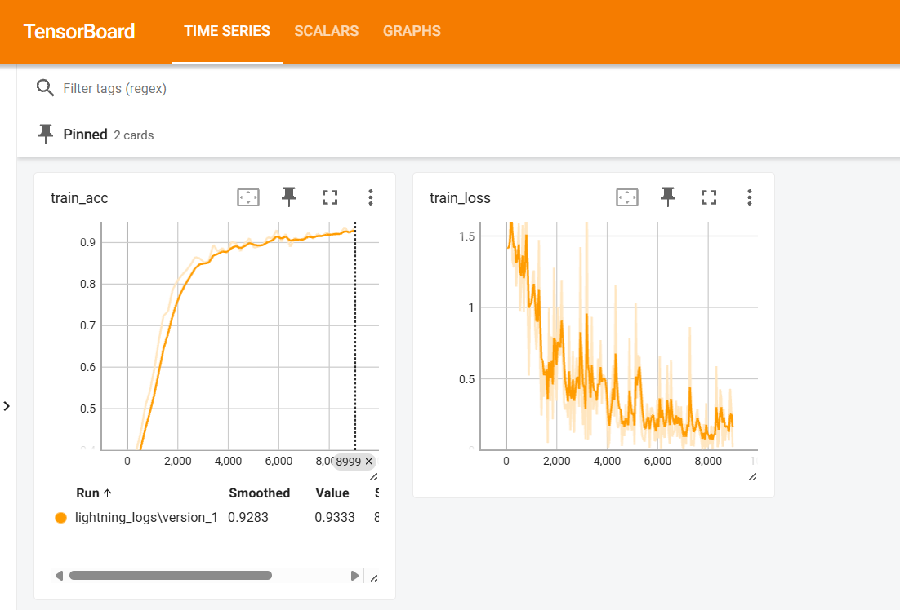

## Automated Optical Inspection (AOI)

Automated Optical Inspection (AOI) systems are widely used in manufacturing environments to ensure product quality through early defect detection. As production volumes increase, manual inspection becomes inefficient, inconsistent, and costly. AOI enables **fast, repeatable, and objective quality control** by leveraging computer vision models in real time.

This project implements an end-to-end AOI pipeline for **metal surface defect detection**, capable of ingesting images, performing inference, and presenting inspection results through a lightweight SCADA-style interface.

### Key Features

* ⚡ **~120 ms inference latency**
* 🟢 **Low end-to-end response time**
* 🎯 **Reliable defect classification**
* 📊 Clear PASS / FAIL quality decision logic


## System Architecture

The platform is composed of three decoupled services:

* **Frontend (React)**
  A lightweight SCADA-style web interface for image upload, visualization, and inspection results.

* **Backend (Go)**
  Handles image ingestion, file storage, orchestration, quality control logic, and communication between services.

* **Inference Service (Python)**
  Performs computer vision inference and returns structured detection results.


## Demo Workflow

1. Upload a metal surface image
2. The system performs inference and quality evaluation
3. Defects are visualized with bounding boxes
4. A PASS / FAIL decision is returned to the operator

<p align="center">
  
</p>


## Trained Model Results

| Prediction                                          | Actual Labels                                       |
| --------------------------------------------------- | --------------------------------------------------- |
|  |  |

The model detects surface defects such as **crazing, inclusions, and scratches**, returning bounding boxes, confidence scores, and class labels for downstream quality control logic.


## Future work
Usually the hardest part of these systems is the collection and labeling of data. This step would require a **vision** service, which could be implemented using C++.

### The key idea
#### ResNet
By using this well known architecture in the `notebook` folder I revised how well does a general classification model performs in the dataset. Because the backbone of YOLO is around Residual Networks, we expect a similar result in performance. The results of the ResNet can be visualized in a tensorboard. And they look like this
<p align="center">
  
</p>

#### YOLO26
An interesting part of a computer vision model is the design of the loss function. I use the MuSGD optimizer, for comparison classical SGD uses
```math
\theta_{t+1}=\theta_t - \eta \nabla L(\theta_t)
```
which oscillates a lot. Using momentum SGD still has its limitations (i.e., may overshoot in non-convex regions). 

In the other hand Muon uses gradient normalization and curve scaling
```math
\tilde{g}_t=\frac{g_t}{\|g_t\| + \epsilon}
```
This stabilizes updates across layers of different scales (usually used in LLMs). The presented model blends SGD's generalization and Muon's stability, which look like
```math
v_t=\beta v_{t-1} + \mu \frac{\nabla L}{\|\nabla L\| + \epsilon}, \theta_{t+1}=\theta_t - \eta v_t
```
this matter for detection because the detection loss is a sum of multiple of objectives, and may differ in magnitude. This leans to faster convergence. With __less tuning__ we get faster inference and better stability. 

### Notes

* Designed with **industrial AOI constraints** in mind (latency, robustness, modularity)
* Easily extensible to new defect classes or additional inspection stages
* Ready for containerized deployment (Docker / Compose)


