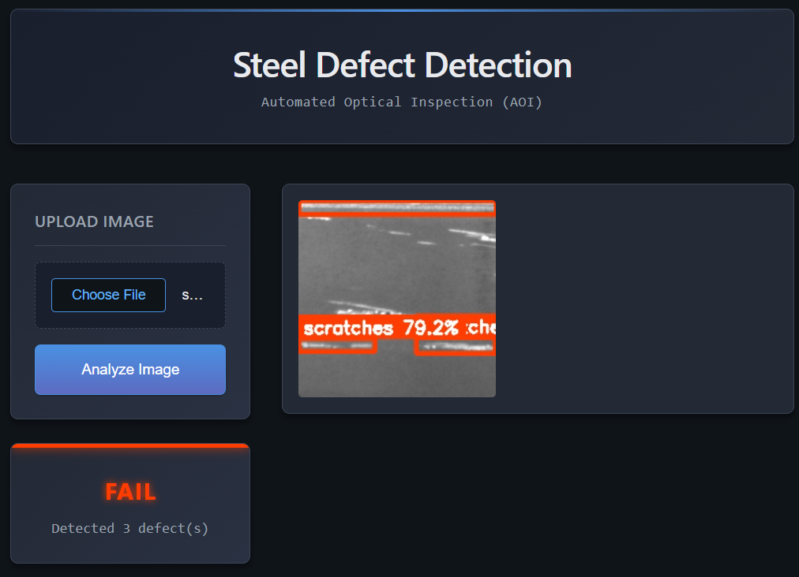

## Automated Optical Inspection (AOI)

Automated Optical Inspection (AOI) systems are widely used in manufacturing environments to ensure product quality through early defect detection. As production volumes increase, manual inspection becomes inefficient, inconsistent, and costly. AOI enables **fast, repeatable, and objective quality control** by leveraging computer vision models in real time.

This project implements an end-to-end AOI pipeline for **metal surface defect detection**, capable of ingesting images, performing inference, and presenting inspection results through a lightweight SCADA-style interface.

### Key Features

* ⚡ **~120 ms inference latency**
* 🟢 **Low end-to-end response time**
* 🎯 **Reliable defect classification**
* 📊 Clear PASS / FAIL quality decision logic

The system uses **YOLOv26** (latest YOLO generation) for object detection, achieving an **F1-score of ~70%** with relatively low training effort.

## System Architecture

The platform is composed of three decoupled services:

* **Frontend (React)**
  A lightweight SCADA-style web interface for image upload, visualization, and inspection results.

* **Backend (Go)**
  Handles image ingestion, file storage, orchestration, quality control logic, and communication between services.

* **Inference Service (Python + YOLO)**
  Performs computer vision inference and returns structured detection results.

## Demo Workflow

1. Upload a metal surface image
2. The system performs inference and quality evaluation
3. Defects are visualized with bounding boxes
4. A PASS / FAIL decision is returned to the operator

  

## Trained Model Results

| Prediction                                          | Validation                                          |
| --------------------------------------------------- | --------------------------------------------------- |
|  |  |

The model detects surface defects such as **crazing, inclusions, and scratches**, returning bounding boxes, confidence scores, and class labels for downstream quality control logic.

## Future work
Usually the hardest part of these systems is the collection and labeling of data. This step would require a **vision** service, which could be implemented using C++.

### Notes

* Designed with **industrial AOI constraints** in mind (latency, robustness, modularity)
* Easily extensible to new defect classes or additional inspection stages
* Ready for containerized deployment (Docker / Compose)

